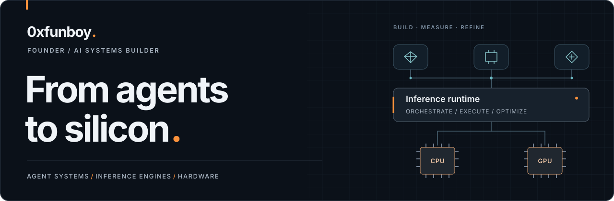
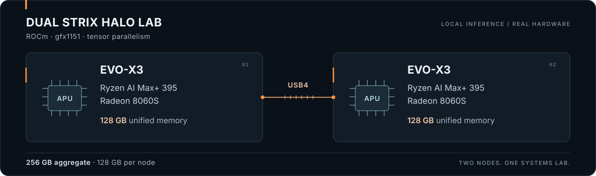
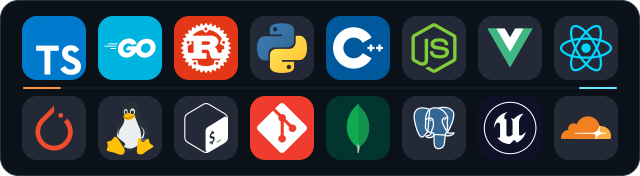

  <picture>
    <source media="(max-width: 600px)" srcset="assets/profile-hero-mobile.svg">
    
  </picture>

  <a href="#user-content-selected-work">Selected work</a> ·
  <a href="#user-content-inference--hardware">Inference &amp; hardware</a> ·
  <a href="#user-content-agents--embodiment">Agents &amp; embodiment</a> ·
  <a href="#user-content-github-in-numbers">GitHub activity</a> ·
  <a href="https://airewardrop.xyz">AIRewardrop</a> ·
  <a href="https://x.com/funB0Tnft">Connect on X</a>

  

## I build the systems around the intelligence.

I'm **funboy**, founder of **[AIRewardrop](https://airewardrop.xyz)** and an independent **AI systems builder**. I connect agent behavior, developer workflows, inference software and physical infrastructure into systems I can run, inspect and improve.

My path started with **gaming, retrogaming and hands-on hardware**, then grew into building and running IT and telecommunications businesses: networks, servers, security and customer operations. Crypto and on-chain automation brought another layer: software that interacts with markets and communities. Today, that experience converges in **local AI, agent tooling and inference engineering**.

I work across the stack: from a conversational interface and its tools to model loading, memory constraints, GPU execution and communication between machines. **The connection between those layers is where I do my best work.**

## Selected work

<table>
<tr>
<td width="50%" valign="top">
01 / LOCAL AI &amp; INFERENCE
<h3><a href="https://github.com/0xfunboy/StrixHaloClusterGLM">HaloClu</a></h3>

A local AI workspace for paired AMD Strix Halo machines. Browser chat, Pi coding workspaces, protected edits, independent verification, model downloads and cluster telemetry, connected through a lightweight Go gateway.

<code>Go</code> <code>ROCm</code> <code>TP2</code> <code>Pi</code> Documented GLM reference deployment

</td>
<td width="50%" valign="top">
02 / MACHINE DIAGNOSTICS
<h3><a href="https://github.com/0xfunboy/KernAid">KernAid</a></h3>

An AI diagnostics platform spanning a native desktop app, bootable rescue environment and fleet tooling. Bounded machine inspection, pluggable LLM providers and auditable reports support explicit control over system changes.

<code>Rust</code> <code>Linux</code> <code>Diagnostics</code> Engineering preview · stable path is diagnosis-only

</td>
</tr>
<tr>
<td width="50%" valign="top">
03 / CODING AGENTS
<h3><a href="https://github.com/0xfunboy/VSPiLink">VSPiLink</a></h3>

A VS Code workspace bridge built on PiLink. My extensions add a native dashboard, guided MCP/OAuth setup, hosting controls and supervised local Pi agents, connecting ChatGPT to an operator-controlled development environment.

<code>TypeScript</code> <code>VS Code</code> <code>MCP</code> PiLink fork · <a href="https://github.com/0xfunboy/VSPiLink/blob/master/docs/UPSTREAM_LINEAGE.md">upstream lineage</a>

</td>
<td width="50%" valign="top">
04 / MODEL GATEWAYS
<h3><a href="https://github.com/0xfunboy/GemRouterFE">GemRouterFE</a></h3>

An OpenAI-compatible Gemini gateway with multi-key routing, quota accounting, fallback and an operator dashboard. It also connects local Ollama routes for embeddings and vision to the same service layer.

<code>TypeScript</code> <code>Node.js</code> <code>Ollama</code> Routing, observability and provider integration

</td>
</tr>
<tr>
<td width="50%" valign="top">
05 / EMBODIED INTERFACES
<h3><a href="https://github.com/0xfunboy/airifica-web">airifica-web</a></h3>

An AIR³ interface combining a real-time 3D avatar, wallet-authenticated conversations and voice. It connects market context, trading workflows and Telegram handoff through an ElizaOS-backed agent.

<code>Vue</code> <code>ElizaOS</code> <code>Voice</code> <code>Web3</code> AIR³ / AIRewardrop product interface

</td>
<td width="50%" valign="top">
06 / MULTIMODAL AGENTS
<h3><a href="https://github.com/0xfunboy/GoonersBot">GoonersBot</a></h3>

A self-hosted Telegram agent with durable social memory, voice, vision and tool-driven research. Its architecture connects provenance-aware recall, validated multi-action plans and group-specific behavior.

<code>TypeScript</code> <code>MongoDB</code> <code>Telegram</code> Agent behavior shaped by community context

</td>
</tr>
</table>

## Inference & hardware

**Hardware is part of my development process.** I build and operate the machines, then work through the constraints that determine whether a model is actually usable: memory capacity, quantization, kernel support, interconnect cost and response latency.

  <picture>
    <source media="(max-width: 600px)" srcset="assets/inference-lab-mobile.svg">
    
  </picture>

The [HaloClu reference deployment](https://github.com/0xfunboy/StrixHaloClusterGLM/blob/main/docs/REFERENCE_DEPLOYMENT.md) runs hybrid W4 GLM inference with **tensor parallelism across two nodes**, **RCCL Socket over USB4** and **DFlash2 speculative decoding**. The product layer brings that runtime into daily chat and supervised coding workflows.

My inference work also includes:

- **[Local LLM Autopilot](https://github.com/0xfunboy/llama.cpp-model-select)** — my llama.cpp fork, adding model discovery, hardware fit planning, measured evaluation and runtime selection to the native server UI.
- **[ds4-multicuda](https://github.com/0xfunboy/ds4-multicuda)** — my fork of antirez's ds4, exploring native CUDA multi-GPU expert placement across consumer GPUs and asymmetric PCIe links.
- **[StrixHaloClusterDS41](https://github.com/0xfunboy/StrixHaloClusterDS41)** — an experimental DeepSeek V4.1 Flash runtime fork of HaloClu, exploring deployment on the same dual-Strix Halo platform.

I keep speed claims attached to their **model, quantization, prompt and measurement conditions**. Numerical correctness, reproducible tests and retained failure results guide the work. See HaloClu's [qualification record](https://github.com/0xfunboy/StrixHaloClusterGLM/blob/main/QUALIFICATION.md) for the tested scope and current limits.

## Agents & embodiment

**AIRewardrop / AIR³** is where my work on agents, interactive products and on-chain systems comes together. I'm interested in the whole interaction loop: what an agent can perceive, what it remembers, which tools it can use and how people stay in control of its actions.

Beyond the projects above, I build the components that give those agents a presence:

- **Voice and avatars** — [Eliza2Face](https://github.com/0xfunboy/Eliza2Face) connects local TTS to avatar-ready audio; my [Unreal Engine SDK fork](https://github.com/0xfunboy/AIR3-ElizaOS-UnrealE55-SDK) explores conversational agents with environment perception and in-world actions.
- **Platform integrations** — ElizaOS clients for [Twitch](https://github.com/0xfunboy/client-twitch), [Reddit](https://github.com/0xfunboy/client-reddit), [Farcaster](https://github.com/0xfunboy/client-farcaster) and [Telegram](https://github.com/0xfunboy/client-telegram-airifica).
- **Markets and on-chain workflows** — [AIRTrack](https://github.com/0xfunboy/AIRTrack) for agent trade tracking, [RIP2ETF](https://github.com/0xfunboy/RIP2ETF) for structured ETF snapshots and [ZordBOT](https://github.com/0xfunboy/ZordBOT) for Zcash Ordinal mint orchestration.
- **Physical signals and models** — [Somatic / SomaBridge](https://github.com/0xfunboy/Somatic), a research prototype exploring machine telemetry, learned sensor projections and embodied agent interfaces.

## How I work

**Build across boundaries.** Product interfaces, agents, APIs, runtimes and deployment belong in the same engineering conversation.

**Make behavior inspectable.** Tool activity, memory provenance, telemetry and independent verification help turn a model's output into something a person can evaluate.

**Measure on real machines.** I use local hardware to investigate memory pressure, numerical behavior and performance, and document the conditions behind each result.

**Build with the ecosystem.** My work includes original applications, integrations and focused forks. Upstream projects such as Pi, PiLink, llama.cpp and ElizaOS are part of that foundation.

| Area | Tools and systems I work with |
| :--- | :--- |
| Agents & developer workflows | TypeScript · Node.js · Pi · MCP · ElizaOS · VS Code · Playwright |
| Inference & systems | Go · Python · C/C++ · Rust · PyTorch / LibTorch · ROCm · CUDA · GGUF |
| Products & interfaces | Vue · React · native web interfaces · Telegram · Unreal Engine · TTS / STT |
| Infrastructure & data | Linux · systemd · networking · USB4 · Cloudflare · MongoDB · PostgreSQL |

  

## GitHub in numbers

A view of my public repositories and ongoing work, updated daily from GitHub.

  
  

## Consistency & activity

  

  

## Contribution snake

A nod to my retrogaming roots, tracing the contribution calendar one square at a time.

  <picture>
    <source media="(prefers-color-scheme: dark)" srcset="https://raw.githubusercontent.com/0xfunboy/0xfunboy/output/github-snake-dark.svg">
    
  </picture>

---

  <b>Building useful intelligence, from the interface to the machine.</b> 
  Interested in local AI, agent tooling, inference infrastructure or embodied interfaces? 
  <a href="https://airewardrop.xyz">AIRewardrop</a> ·
  <a href="https://x.com/funB0Tnft">X / @funB0Tnft</a> ·
  <a href="https://t.me/funboynft">Telegram</a> ·
  <a href="https://github.com/0xfunboy?tab=repositories">Explore all repositories</a>

